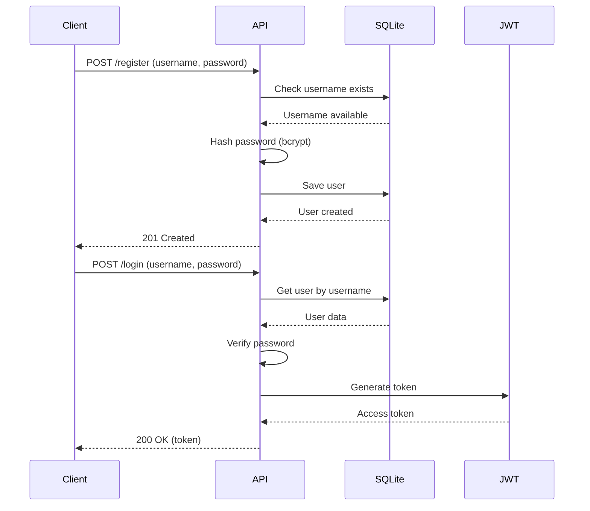
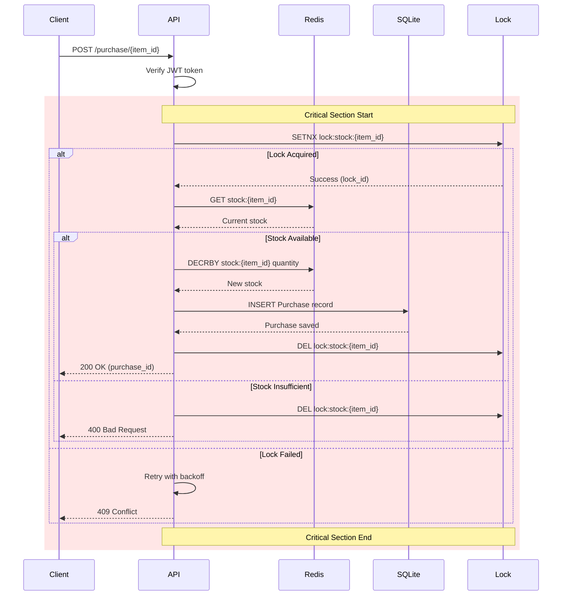
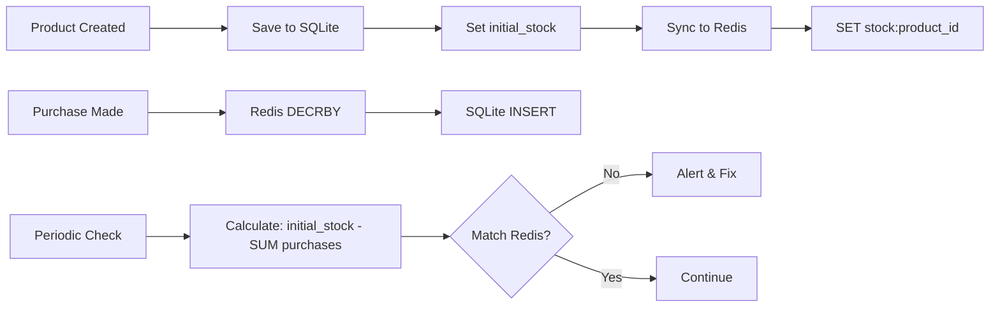
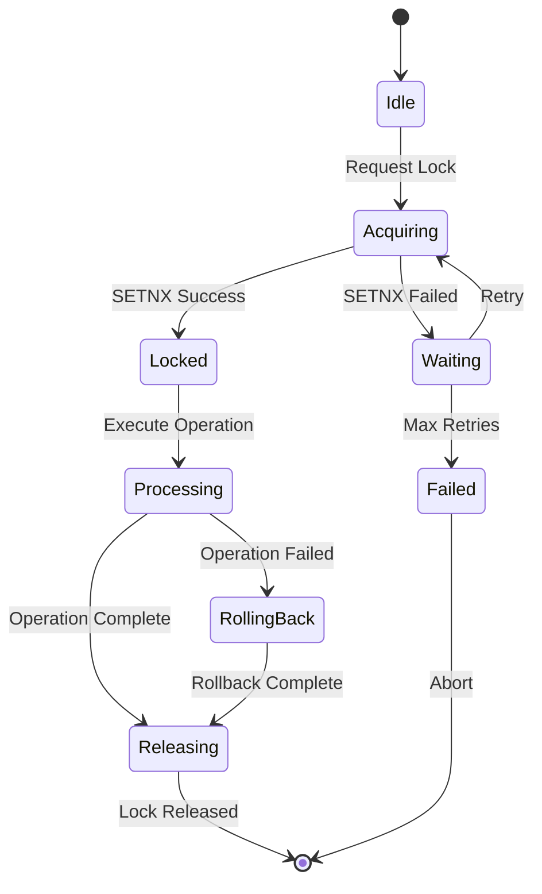

# 시스템 아키텍처 설계 문서

## 📐 아키텍처 개요

블랙프라이데이 한정 판매 시스템은 높은 동시성을 처리하기 위해 Redis 기반 분산 락과 이중 레이어 저장소 구조를 채택합니다.

---

## 🏗️ 시스템 컴포넌트

```
┌─────────────────────────────────────────────────────────────┐
│                         Client Layer                         │
│                    (Web/Mobile Applications)                 │
└─────────────────────────────────────────────────────────────┘
                                │
                                ▼
┌─────────────────────────────────────────────────────────────┐
│                      API Gateway (Nginx)                     │
│                    - Rate Limiting                           │
│                    - Load Balancing                          │
│                    - SSL Termination                         │
└─────────────────────────────────────────────────────────────┘
                                │
                ┌───────────────┼───────────────┐
                ▼               ▼               ▼
┌──────────────────┐ ┌──────────────────┐ ┌──────────────────┐
│  FastAPI App #1  │ │  FastAPI App #2  │ │  FastAPI App #3  │
│   - Auth API     │ │   - Auth API     │ │   - Auth API     │
│   - Inventory    │ │   - Inventory    │ │   - Inventory    │
│   - Purchase     │ │   - Purchase     │ │   - Purchase     │
└──────────────────┘ └──────────────────┘ └──────────────────┘
        │                    │                    │
        └────────────────────┼────────────────────┘
                             │
        ┌────────────────────┼────────────────────┐
        ▼                    ▼                    ▼
┌──────────────┐    ┌──────────────┐    ┌──────────────┐
│  Redis #1    │    │  Redis #2    │    │  Redis #3    │
│  (Primary)   │◄───│  (Replica)   │◄───│  (Replica)   │
│              │    │              │    │              │
│ - Inventory  │    │ - Read Only  │    │ - Read Only  │
│ - Locks      │    │              │    │              │
└──────────────┘    └──────────────┘    └──────────────┘
        │
        ▼
┌─────────────────────────────────────────────────────────────┐
│                         SQLite DB                            │
│                    - Users                                   │
│                    - Products                                │
│                    - Purchase History                        │
└─────────────────────────────────────────────────────────────┘
```

---

## 🔄 데이터 플로우

### 1. 인증 플로우



### 2. 구매 처리 플로우



### 3. 재고 동기화 플로우



---

## 🔒 락 상태 머신



### 락 구현 상세

```python
class RedisLock:
    """Redis 기반 분산 락 구현"""

    def __init__(self, redis_client: Redis, resource: str, ttl: int = 10):
        self.redis = redis_client
        self.resource = resource
        self.ttl = ttl
        self.lock_id = str(uuid.uuid4())

    async def acquire(self, timeout: float = 10.0) -> bool:
        """
        락 획득 시도
        - SETNX 사용 (SET if Not eXists)
        - TTL 설정으로 데드락 방지
        - 타임아웃까지 재시도
        """
        end_time = time.time() + timeout

        while time.time() < end_time:
            # 원자적 SET NX EX 연산
            acquired = await self.redis.set(
                self.resource,
                self.lock_id,
                nx=True,  # Only set if not exists
                ex=self.ttl  # Expiry time
            )

            if acquired:
                return True

            # Exponential backoff
            await asyncio.sleep(0.1 * (2 ** random.random()))

        return False

    async def release(self) -> bool:
        """
        락 해제
        - Lua 스크립트로 원자적 처리
        - 자신이 획득한 락만 해제
        """
        lua_script = """
        if redis.call("GET", KEYS[1]) == ARGV[1] then
            return redis.call("DEL", KEYS[1])
        else
            return 0
        end
        """

        result = await self.redis.eval(
            lua_script,
            keys=[self.resource],
            args=[self.lock_id]
        )

        return bool(result)
```

---

## 💾 데이터 모델

### SQLite Schema

```sql
-- 사용자 테이블
CREATE TABLE users (
    id INTEGER PRIMARY KEY AUTOINCREMENT,
    username VARCHAR(50) UNIQUE NOT NULL,
    hashed_password VARCHAR(255) NOT NULL,
    created_at TIMESTAMP DEFAULT CURRENT_TIMESTAMP
);

-- 상품 테이블
CREATE TABLE products (
    id INTEGER PRIMARY KEY AUTOINCREMENT,
    name VARCHAR(100) NOT NULL,
    price DECIMAL(10, 2) NOT NULL,
    initial_stock INTEGER NOT NULL,  -- 초기 재고
    created_at TIMESTAMP DEFAULT CURRENT_TIMESTAMP
);

-- 구매 이력 테이블
CREATE TABLE purchases (
    id INTEGER PRIMARY KEY AUTOINCREMENT,
    user_id INTEGER NOT NULL,
    product_id INTEGER NOT NULL,
    quantity INTEGER NOT NULL,
    total_price DECIMAL(10, 2) NOT NULL,
    purchased_at TIMESTAMP DEFAULT CURRENT_TIMESTAMP,
    FOREIGN KEY (user_id) REFERENCES users(id),
    FOREIGN KEY (product_id) REFERENCES products(id)
);

-- 인덱스
CREATE INDEX idx_purchases_user ON purchases(user_id);
CREATE INDEX idx_purchases_product ON purchases(product_id);
CREATE INDEX idx_purchases_date ON purchases(purchased_at);
```

### Redis Data Structure

```bash
# 재고 데이터 (String)
stock:{product_id} -> "100"

# 분산 락 (String with TTL)
lock:stock:{product_id} -> "uuid-lock-id"
TTL: 10 seconds

# 재고 변경 이벤트 (Stream) - v4에서 추가
stock:events -> [
    {
        "product_id": 1,
        "action": "decrease",
        "quantity": 1,
        "timestamp": 1234567890
    }
]

# 메트릭 (Hash) - v4에서 추가
metrics:lock:{product_id} -> {
    "acquired_count": "1000",
    "failed_count": "50",
    "avg_wait_time": "120",
    "last_acquired": "1234567890"
}
```

---

## 🎯 핵심 설계 원칙

### 1. 이중 레이어 저장소

```
┌────────────────────────────────────┐
│         Performance Layer          │
│            (Redis)                 │
│   - Real-time inventory            │
│   - Distributed locks              │
│   - Fast reads/writes              │
└────────────────────────────────────┘
                 │
                 ▼
┌────────────────────────────────────┐
│        Persistence Layer           │
│           (SQLite)                 │
│   - User accounts                  │
│   - Product catalog                │
│   - Purchase history               │
│   - Audit trail                    │
└────────────────────────────────────┘
```

**이유**:
- Redis: 빠른 응답시간, 원자적 연산
- SQLite: 영구 저장, 복잡한 쿼리, 트랜잭션

### 2. 비관적 락 선택 이유

| 방식 | 장점 | 단점 | 적합한 경우 |
|------|------|------|------------|
| **비관적 락** | 데이터 일관성 보장 | 성능 저하 가능성 | 충돌이 빈번한 경우 |
| 낙관적 락 | 높은 처리량 | 재시도 로직 필요 | 충돌이 드문 경우 |

**블랙프라이데이 시나리오**:
- 1초에 1000명 동시 접근 → 충돌 빈번
- 재고 정확성이 최우선 → 비관적 락 선택

### 3. Lua 스크립트 활용

```lua
-- 원자적 재고 감소
local current = redis.call('GET', KEYS[1])
if not current then
    return {err = "Stock not found"}
end

current = tonumber(current)
local quantity = tonumber(ARGV[1])

if current < quantity then
    return {err = "Insufficient stock"}
end

redis.call('DECRBY', KEYS[1], quantity)
return {ok = current - quantity}
```

**장점**:
- 네트워크 왕복 최소화
- 원자성 보장
- 경쟁 조건 제거

---

## 🔄 확장 포인트

### 수평 확장

```
                Load Balancer
                     │
        ┌────────────┼────────────┐
        ▼            ▼            ▼
    FastAPI #1   FastAPI #2   FastAPI #N
        │            │            │
        └────────────┼────────────┘
                     ▼
            Redis Cluster (Sharded)
```

### 수직 확장

- Redis: 메모리 증설
- FastAPI: CPU 코어 추가
- SQLite → PostgreSQL 마이그레이션

### 기능 확장 포인트

1. **이벤트 기반 아키텍처**
   - Redis Streams/Pub-Sub
   - 비동기 처리
   - CQRS 패턴

2. **캐싱 레이어**
   - CDN 정적 콘텐츠
   - Redis 읽기 캐시
   - 애플리케이션 레벨 캐시

3. **모니터링 확장**
   - APM (Application Performance Monitoring)
   - 분산 추적 (Jaeger/Zipkin)
   - 로그 집계 (ELK Stack)

---

## 🔐 보안 아키텍처

### 인증/인가

```
Client Request
    │
    ▼
[JWT Validation]
    │
    ├─ Invalid → 401 Unauthorized
    │
    └─ Valid → [Role Check]
                    │
                    ├─ Insufficient → 403 Forbidden
                    │
                    └─ Authorized → [Process Request]
```

### 데이터 보호

- **전송 중**: TLS 1.3
- **저장 중**: SQLite 암호화, Redis AUTH
- **비밀번호**: bcrypt (cost factor 12)
- **토큰**: JWT with HS256

### Rate Limiting

```python
# IP 기반 Rate Limiting
rate_limits = {
    "/purchase": "10/minute",
    "/inventory": "100/minute",
    "/login": "5/minute"
}
```

---

## 📊 성능 고려사항

### 병목 지점 분석

1. **Redis 락 경합**
   - 해결: 락 세분화, 샤딩

2. **네트워크 지연**
   - 해결: Connection pooling, Pipeline

3. **DB 쓰기 부하**
   - 해결: 배치 처리, 비동기 쓰기

### 최적화 전략

```python
# Connection Pooling
redis_pool = aioredis.ConnectionPool(
    host='localhost',
    port=6379,
    max_connections=50,
    min_idle_time=30,
    max_idle_time=300
)

# Pipeline for batch operations
async with redis.pipeline() as pipe:
    for product_id in product_ids:
        pipe.get(f"stock:{product_id}")
    results = await pipe.execute()
```

---

## 🔮 향후 아키텍처 진화

### Phase 1: 모놀리스 (현재)
- 단일 FastAPI 애플리케이션
- SQLite + Redis
- 동기식 처리

### Phase 2: 모듈화
- 도메인별 모듈 분리
- 비동기 이벤트 처리
- PostgreSQL 마이그레이션

### Phase 3: 마이크로서비스
- 서비스별 분리 (Auth, Inventory, Order)
- API Gateway
- Service Mesh (Istio)

### Phase 4: 서버리스
- Lambda/Cloud Functions
- DynamoDB/Cosmos DB
- Event-driven 아키텍처

---

## 📚 참고 자료

- [Redis Best Practices](https://redis.io/docs/management/optimization/)
- [FastAPI Production Deployment](https://fastapi.tiangolo.com/deployment/)
- [Distributed Systems Design](https://www.oreilly.com/library/view/designing-distributed-systems/9781491983638/)