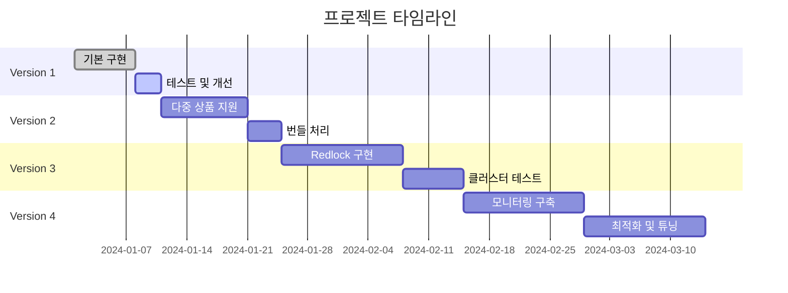

# 프로젝트 로드맵

## 🎯 목표: 블랙프라이데이 한정 판매 시스템

실제 이커머스에서 발생하는 "한정 수량 상품의 동시 구매 폭주" 상황을 단계적으로 해결합니다.

---

## 📊 버전별 요약

| 버전 | 핵심 목표 | 기술 스택 | 성능 목표 |
|------|-----------|-----------|-----------|
| v1 | 기본 락 구현 | Redis SETNX + FastAPI | 100 TPS |
| v2 | 다중 상품 지원 | 데드락 방지 + 번들 처리 | 200 TPS |
| v3 | 분산 환경 대응 | Redlock + Redis Cluster | 500 TPS |
| v4 | 프로덕션 최적화 | 모니터링 + Circuit Breaker | 1000+ TPS |

---

## 🔷 Version 1: 기본 구현 (현재 진행중)

### 목표
단일 Redis 인스턴스에서 비관적 락을 구현하여 재고 동시성 문제 해결

### 상세 구현 태스크

#### ✅ 완료된 작업
- [x] Redis SETNX 기반 락 메커니즘 구현
- [x] Lua 스크립트를 통한 원자적 재고 차감
- [x] JWT 기반 사용자 인증 시스템
- [x] 기본 API 엔드포인트 (회원가입, 로그인, 재고조회, 구매)
- [x] SQLite + Redis 데이터 동기화
- [x] Docker Compose 환경 구성

#### ⏳ 진행중/계획된 작업
- [ ] 재고 롤백 로직 개선 (SET → INCRBY 변경)
- [ ] Saga 패턴 적용 및 테스트 케이스 작성
- [ ] 동시 접근 통합 테스트 강화
- [ ] 락 메트릭 수집 (획득 시간, 대기 시간, 실패율)

### 테스트 시나리오
```python
# tests/test_v1_scenarios.py

# 시나리오 1: 기본 동시성 테스트
- 100명이 동시에 1개씩 구매 (총 100개 재고)
- 예상: 정확히 100개 판매, 초과 판매 0건

# 시나리오 2: 락 타임아웃 테스트
- 락 홀딩 시간 초과 시 자동 해제
- 예상: 데드락 없이 정상 처리

# 시나리오 3: 트랜잭션 롤백 테스트
- DB 저장 실패 시 Redis 재고 복구
- 예상: 재고 정합성 유지
```

### 성능 벤치마크
- **목표 TPS**: 100
- **응답시간**: P50 < 100ms, P99 < 500ms
- **정확도**: 100% (초과 판매 0건)
- **가용성**: 99%

### 주요 학습 포인트
- Redis 단일 노드 락의 한계 경험
- 락 경합 상황에서의 성능 저하 관찰
- 네트워크 지연이 락 성능에 미치는 영향

---

## 🔷 Version 2: 다중 상품 및 번들 지원

### 목표
여러 상품을 동시에 처리하고 번들 상품의 원자적 처리 구현

### 상세 구현 태스크

#### 핵심 기능
- [ ] 다중 상품 재고 관리 시스템
- [ ] 락 획득 순서 정렬 (product_id 오름차순)
- [ ] 번들 상품 트랜잭션 처리
- [ ] 부분 실패 시 전체 롤백 메커니즘
- [ ] 데드락 감지 및 자동 복구

#### 기술적 구현
```python
# 락 획득 순서 통일로 데드락 방지
async def acquire_multiple_locks(product_ids: List[int]):
    sorted_ids = sorted(product_ids)  # 항상 같은 순서로 락 획득
    locks = []
    for product_id in sorted_ids:
        lock = await acquire_lock(f"lock:stock:{product_id}")
        if not lock:
            # 실패 시 이미 획득한 락 모두 해제
            await release_all_locks(locks)
            return None
        locks.append(lock)
    return locks
```

### 테스트 시나리오
```python
# 시나리오 1: 다중 상품 동시 구매
- 10개 상품 각 100개씩 재고
- 100명이 랜덤하게 2-3개 상품 동시 구매
- 예상: 데드락 0건, 정확한 재고 차감

# 시나리오 2: 번들 상품 처리
- A+B+C 세트 상품 구매
- B 재고 부족 시 전체 취소
- 예상: All-or-Nothing 보장

# 시나리오 3: 데드락 시뮬레이션
- Thread1: A→B 순서로 락 시도
- Thread2: B→A 순서로 락 시도
- 예상: 정렬된 순서로 락 획득하여 데드락 방지
```

### 성능 벤치마크
- **목표 TPS**: 200
- **동시 처리 상품**: 최대 10개
- **데드락 발생**: 0건
- **롤백 정확도**: 100%

### 예상 도전 과제
- 다중 락 관리의 복잡성
- 부분 실패 처리 로직
- 트랜잭션 경계 설정

---

## 🔷 Version 3: 분산 환경 (Redlock)

### 목표
Redis 클러스터 환경에서 Redlock 알고리즘으로 분산 락 구현

### 상세 구현 태스크

#### 인프라 구성
- [ ] Redis 클러스터 구성 (3-5개 노드)
- [ ] Docker Swarm/Kubernetes 배포
- [ ] 노드 간 시간 동기화 (NTP)

#### Redlock 구현
- [ ] 쿼럼 기반 락 획득 (N/2+1 노드)
- [ ] 클럭 드리프트 보정
- [ ] 자동 재시도 메커니즘
- [ ] 락 연장(Lock Extension) 기능

```python
class Redlock:
    def __init__(self, redis_nodes: List[Redis], drift_factor=0.01):
        self.nodes = redis_nodes
        self.quorum = len(nodes) // 2 + 1
        self.drift_factor = drift_factor

    async def acquire_lock(self, resource: str, ttl: int):
        # 1. 현재 시간 기록
        start_time = time.time()

        # 2. 모든 노드에 병렬로 락 요청
        acquired_locks = await self._acquire_on_all_nodes(resource, ttl)

        # 3. 클럭 드리프트 계산
        drift = ttl * self.drift_factor + 2
        validity_time = ttl - (time.time() - start_time) - drift

        # 4. 쿼럼 확인 및 유효성 검증
        if len(acquired_locks) >= self.quorum and validity_time > 0:
            return Lock(resource, validity_time)

        # 5. 실패 시 모든 노드에서 락 해제
        await self._release_all_locks(resource)
        return None
```

### 테스트 시나리오
```python
# 시나리오 1: 노드 장애 복구
- 5개 노드 중 1-2개 장애
- 예상: 쿼럼(3개) 유지 시 정상 동작

# 시나리오 2: 네트워크 파티션
- 노드 그룹이 2개로 분리
- 예상: 큰 그룹만 락 획득 가능

# 시나리오 3: 클럭 스큐 테스트
- 노드 간 시간 차이 발생
- 예상: 드리프트 팩터로 보정

# 시나리오 4: 성능 테스트
- 500 TPS 부하 테스트
- 예상: 분산 환경에서도 안정적 처리
```

### 성능 벤치마크
- **목표 TPS**: 500
- **노드 수**: 5개 (쿼럼 3)
- **장애 허용**: 2개 노드
- **락 획득 시간**: < 50ms
- **네트워크 지연 허용**: 최대 100ms

### CAP 트레이드오프
- **Consistency**: 강한 일관성 (쿼럼 기반)
- **Availability**: 부분 가용성 (과반수 노드 필요)
- **Partition Tolerance**: 네트워크 분할 대응

---

## 🔷 Version 4: 프로덕션 최적화

### 목표
실제 운영 환경을 위한 모니터링, 자동 복구, 성능 최적화

### 상세 구현 태스크

#### 모니터링 시스템
- [ ] Prometheus + Grafana 대시보드
- [ ] 주요 메트릭 수집
  - 락 획득/해제 횟수
  - 평균 대기 시간
  - 재고 불일치 감지
  - TPS 및 응답시간
- [ ] 알림 설정 (Slack, PagerDuty)

#### 안정성 향상
- [ ] Circuit Breaker 패턴 구현
- [ ] Bulkhead 패턴 (리소스 격리)
- [ ] 자동 재시도 with Exponential Backoff
- [ ] Health Check 엔드포인트

#### 성능 최적화
- [ ] Redis Pipeline/Transaction 최적화
- [ ] 커넥션 풀 튜닝
- [ ] 읽기 전용 복제본 활용
- [ ] 캐시 레이어 추가 (재고 조회)

#### 운영 기능
- [ ] 재고 불일치 자동 복구 스케줄러
- [ ] 관리자 대시보드 (재고 조정, 락 해제)
- [ ] 감사 로그 (모든 재고 변경 추적)
- [ ] 백업 및 복구 절차

### 고급 기능
```python
# Circuit Breaker 구현 예시
class CircuitBreaker:
    def __init__(self, failure_threshold=5, recovery_timeout=60):
        self.failure_count = 0
        self.failure_threshold = failure_threshold
        self.recovery_timeout = recovery_timeout
        self.state = "CLOSED"  # CLOSED, OPEN, HALF_OPEN

    async def call(self, func, *args, **kwargs):
        if self.state == "OPEN":
            if self._should_attempt_reset():
                self.state = "HALF_OPEN"
            else:
                raise CircuitBreakerOpen()

        try:
            result = await func(*args, **kwargs)
            self._on_success()
            return result
        except Exception as e:
            self._on_failure()
            raise e
```

### 카오스 엔지니어링 테스트
- Redis 노드 랜덤 종료
- 네트워크 지연 주입
- CPU/메모리 스트레스
- 시간 점프 시뮬레이션

### 성능 벤치마크
- **목표 TPS**: 1000+
- **응답시간**: P50 < 50ms, P99 < 200ms
- **가용성**: 99.9% (연간 다운타임 < 8.76시간)
- **복구 시간**: < 30초

---

## 📈 성공 지표

### 기술적 지표
- ✅ 재고 정확도 100%
- ✅ 초과 판매 0건
- ✅ 데이터 정합성 유지
- ✅ 자동 복구 성공률 > 99%

### 비즈니스 지표
- 📊 동시 접속자 1000명 처리
- 📊 평균 응답시간 < 200ms
- 📊 시스템 가용성 99.9%
- 📊 고객 불만 제로

---

## 🎓 학습 성과

### 기술 역량
1. **Redis 마스터리**: 단일 노드부터 클러스터까지
2. **분산 시스템 이해**: CAP 이론, 합의 알고리즘
3. **동시성 제어**: 락, 트랜잭션, 일관성
4. **성능 최적화**: 프로파일링, 병목 해결
5. **운영 경험**: 모니터링, 장애 대응

### 아키텍처 패턴
- Pessimistic Locking
- Distributed Locking (Redlock)
- Saga Pattern
- Circuit Breaker
- Event Sourcing

---

## 📅 타임라인



---

## 🔗 참고 자료

### 필수 학습 자료
- [Redis 공식 문서 - Distributed Locks](https://redis.io/docs/manual/patterns/distributed-locks/)
- [Redlock 알고리즘 논문](https://redis.io/docs/manual/patterns/distributed-locks/#the-redlock-algorithm)
- [Martin Kleppmann의 Redlock 비판](https://martin.kleppmann.com/2016/02/08/how-to-do-distributed-locking.html)

### 추천 도서
- "Designing Data-Intensive Applications" - Martin Kleppmann
- "Redis in Action" - Josiah L. Carlson
- "Building Microservices" - Sam Newman

### 관련 프로젝트
- [python-redis-lock](https://github.com/ionelmc/python-redis-lock)
- [redlock-py](https://github.com/SPSCommerce/redlock-py)
- [aioredlock](https://github.com/zaiqiang-dong/aioredlock)